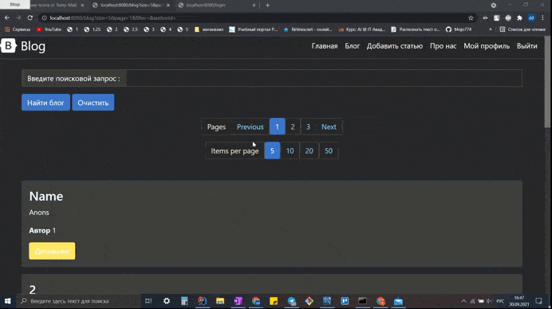

# Веб приложение для введения блога

## Обзор
Каждый пользователь, после прохождении регистрации и подтверждении почты 
получает доступ к созданию своих статей и просмотру статей других пользователей

## Функциональность

* Регистрация аккаунта 

* Визуальное представление статей пользователей
   * Поиск по названию статьи

* Просмотр статьи
   * Редактирование и удаление статьи
    (только для автора или администратора)
   * Возможность поставить оценку
   
* Личный кабинет
   * Возможность изменить пароль или email
   * Подписка на пользователя
   * Просмотр статей пользователя
   * Просмотр подписок/подписчиков пользователя
   * Доступ к списку пользователей с возможностью их удаления
   (только для администратора)
   
## Техническая составляющая
### Backend

* JDK 11

* Spring framework
  * Boot
  * Security
  * Mail
  * Validation

* Maven
* JDBC
* JPA
  * Hibernate
    * HQL (JPQL)

* SQL
  * MySQL
 
* Миграция БД - flyway

### Frontend

* Шаблонизатор - thymeleaf
* Сайт с шаблонами - bootstrap
* Сайт с иконками - font awesome
* Pagination
* Turbolinks
 
### Тестирование

* JUnit
* Mockito
* Hamcrest

### Deploy

* Hosting - Heroku  
* BD - ClearBD

(В связи с тем что тариф хостинга бесплатный сайт падает каждые полчаса и БД дропается)  
(Из-за этого письмо на почту для подтверждния регистрации, скорее всего, не придет (проблема с гуглом))  
(Тариф БД так же бесплатный - падает при малейшей нагрузке)  
https://blog227.herokuapp.com/  

### GIF

* Главная страница, регистрация

* Подтверждение почты, создание статьи

* Просмотр всех статей и редактирование статьи

* Просмотр конкретной статьи и профили пользователей

* Редактирование профиля

* Профиль админа и удаление статьи

